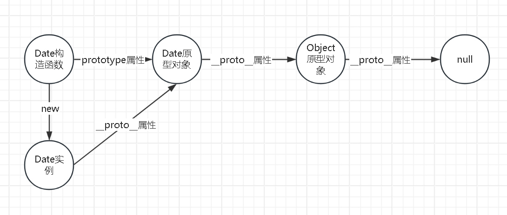

# JavaScript

## JavaScript是什么
JavaScript 是被设计用来为HTML页面添加简单交互性的脚本语言。但随着互联网的发展，js生态也在不断的演进着。


## JS 特点

- 动态类型：变量的类型在运行时确定，同一个变量可以存储不同类型的值
- 弱类型：在运算时会进行隐式类型转换
- 解释执行：不需要编译，由解释器直接运行
- 基于原型：通过原型链实现继承
- 单线程执行：JavaScript的执行是单线程的，通过事件循环处理并发
- 函数是一等公民：函数可以作为参数传递，也可以作为返回值


## JS API

### DOM  API

### BOM  API

### fetch 与 XMLHttpRequest

fetch与XMLHttpRequest用于发送http请求。

- fetch 的语法风格是promise风格
- fetch 能在service worker中使用
- fetch 同源请求下也可以自定义不带 cookie，提升性能
- fetch 可自定义重定向场景，xhr只能follow
- 可自定义referrer
- 更多自由的cache配置
  - reload：拉去最新资源即使资源未改变；
  - force-cache：有缓存强制使用，即使是缓存过期了；
  - only-if-cache：同上，不存在缓存时报错。


### navigator

#### navigator.sendBeacon


#### navigator.msSaveBlob


##### msSaveBlob 和 msSaveOrOpenBlob

*定义：msSavaBlob 和msSaveOrOpenBlob 方法允许用户在客户端上保存文件，方法如同从 Internet 下载文件，这是此类文件保存到“下载”文件夹的原因。*

前者只提供保存按钮，后者提供和打开按钮

```js
let blobObject = new Blob([data], {
          //type类型后端返回来的数据中会有，根据实际进行修改
          type: "application/pdf;charset-UTF-8"
        });
if (typeof window.navigator.msSaveBlob !== "undefined") {
          window.navigator.msSaveBlob(blobObject, filename);
		}
```

##### 移动端独有：用户是否使用了双指缩放

```js
window.visualViewport.scale
```


### ES6+的新特性

#### let

var 和 let 的都用于变量的声明，但在使用上存在诸多区别

```js
// 作用域
function test() { 
    // var 函数作用域，test函数内都有效
    if (true) { var x = 1; } 
    console.log(x);  // 1 
    // let 块级作用域，let所在的{}内有效
    if (true) { let y = 1; } 
    console.log(y);  // ReferenceError 
}

// 变量提升
function example() {
  console.log(x); // undefined (var提升)
  console.log(y); // ReferenceError (let在TDZ)
  var x = 1; // 声明被提升了，并被赋予了初始值undefined
  let y = 2; // 声明被提升了，但在声明代码正式执行前，不可访问（即暂时性死区TDZ）
}

// 重复声明
var x = 1; var x = 2; // ok
let x = 1; let x = 2; // SyntaxError

// 在全局作用域中声明时
var x = 1; console.log(window.x); // 1 (浏览器中)
let x = 1; console.log(window.x); // undefined

// 循环中使用
for (var i = 0; i < 3; i++) {
  setTimeout(() => console.log(i), 100); // 输出3次3； var 在循环中的表现
}
for (let i = 0; i < 3; i++) {
  setTimeout(() => console.log(i), 100); // 输出0,1,2； let 在循环中的表现
}
```


#### const

```js
// 用于声明常量。通过const声明的变量，不可修改声明的栈地址内的值

// 基本类型表现为不能修改值
const a = 1; 
a = 2 // error 

// 引用类型表现为不能修改引用地址
const obj = {b:1};
obj.b = 2 // ok
obj = {} // error
```


#### 箭头函数

```js
// 主要用于消除函数的二义性问题

// 调用方式上
function a(){...}
a() // ok
new a() // ok 既可以作为普通函数，也可以作为构造函数使用，存在二义性。
const b = () => {...}
b() // ok 只能作为一般函数使用
new b() // error
                 
// this表现的区别
const obj = {
  name: 'Alice',
  regular: function() { console.log(this.name) },  // 执行时确定，动态绑定，取决于调用方式
  arrow: () => console.log(this.name)             // 定义时确定，静态绑定，继承外层作用域
}
obj.regular()  // Alice
obj.arrow()    // undefined
                 
// 原型属性
function regular() {}
const arrow = () => {}
console.log(regular.prototype)
console.log(arrow.prototype)  // 不可作为构造函数，所以没有原型

// arguments
function regular() { console.log(arguments) }  // Arguments(3) [1, 2, 3]
const arrow = () => console.log(arguments)    // ReferenceError
```


#### Symbol

```js
// ES6引入的新基本类型，用于声明唯一的值。主要用于避免命名冲突。

// 值都是唯一的
Symbol('foo') === Symbol('foo') // false

// 可作为属性名
const mySymbol = Symbol('myKey');
const obj = {
  [mySymbol]: 'secret value',
};

// Symbol.for() Symbol.keyFor() 全局Symbol的维护
const globalSym = Symbol.for('globalKey');
const sameGlobalSym = Symbol.for('globalKey'); // 重复声明时，会返回已经声明的值
console.log(globalSym === sameGlobalSym); // true
console.log(Symbol.keyFor(globalSym)); // "globalKey"

// 一些内置 Symbol 值
// Symbol.iterator 使对象可迭代
const myIterable = {
  [Symbol.iterator]: function* () {
    yield 1;
    yield 2;
    yield 3;
  }
};
console.log([...myIterable]); // [1, 2, 3]
// Symbol.toStringTag 自定义toString行为
class MyClass {
  get [Symbol.toStringTag]() {
    return 'MyCustomClass';
  }
}
const instance = new MyClass();
console.log(instance.toString()); // "[object MyCustomClass]"
// Symbol.hasInstance 自定义instanceof行为
class MyArray {
  static [Symbol.hasInstance](instance) {
    return Array.isArray(instance);
  }
}
console.log([] instanceof MyArray); // true
// Symbol.toPrimitive 自定义隐式类型转化的行为
const obj = {
  [Symbol.toPrimitive](hint) {
    if (hint === 'number') return 42;
    if (hint === 'string') return 'forty-two';
    return true;
  }
};
console.log(+obj); // 42 (number上下文)
console.log(`${obj}`); // "forty-two" (string上下文)
console.log(obj + ''); // "true" (default上下文)
```


#### Map

```js
// Map 是ES6新引入的集合类型
// 初始化
const mapWithValues = new Map([
  ['key1', 'value1'],
  ['key2', 'value2']
]);

// 操作
map.set('name', 'Alice'); // 添加/更新
map.get('name') // 获取
map.has('name') // 检查键是否存在
map.delete('age') // 删除
map.clear() // 清空

// 有序性 map会保持值插入的顺序
const map = new Map();
map.set('z', 1);
map.set('a', 2);
map.set('b', 3);
console.log([...map.keys()]); // ['z', 'a', 'b']

// 键可以是任意类型
map.set(null, 123);
map.set([], 'arr');
```


####  WeakMap

```js
// WeakMap 和 Map的用法基本一致，区别在于，键值只能是引用类型
const weakMap = new WeakMap();
weakMap.set({}, 'value');  // ok
weakMap.set('name', 'Alice');  // TypeError: Invalid value used as weak map key

// WeakMap回收策略中，不会增加键的引用计数
const map = new Map();
map.set(obj, 'data');
obj = null; // 对象仍在Map中，不会被回收

const weakMap = new WeakMap();
weakMap.set(obj, 'data');
obj = null; // 如果没有其他引用，对象会被垃圾回收策略回收
```


#### Set

```js
// Set 是 ES6 引入的一种集合数据结构，它类似于数组，但成员的值都是唯一的，没有重复的值
const set = new Set();
const setFromArray = new Set([1, 2, 3, 4, 4]); // Set(4) {1, 2, 3, 4} (自动去重)

// 操作
set.add('text'); // 添加
set.has(1) // 检查元素是否存在
set.delete(2) // 删除
set.clear(); // 清空整个Set
```


#### WeakSet

```js
// WeakSet 只能用于存储引用类型数据
const weakMap = new WeakMap();
weakMap.set({}, 'value');  // ok
weakMap.set('name', 'Alice');  // TypeError: Invalid value used as weak map key

// WeakMap回收策略中，不会增加键的引用计数
let obj = { data: 'important' };
weakSet.add(obj);
obj = null; // 如果没有其他引用，对象会被垃圾回收策略回收
```


#### Promise

```js
// Promise 用于解决回调地狱
// 传统编程中我们通过回调函数的方式，来实现异步编程，但这使得代码嵌套层级过剩，代码阅读起来也十分困难

// Promise 用于异步任务管理，任务有3个状态，pending(异步任务未完成)、fulfilled(异步任务成功)、rejected(异步任务失败)

// Promise 的链式调用
myPromise
  .then(handleFulfilledA, handleRejectedA) // then catch 等方法都会返回一个新的promise实例，这使得我们能链式调用
  .then(handleFulfilledB, handleRejectedB)
  .then(handleFulfilledC, handleRejectedC)
  .finally(cb)
```


#### 解构赋值

```js
// 解构赋值，使得我们在赋值操作过程中更加的灵活
// 本质上，结构赋值属于“模式匹配”，只要等号两边的模式相同，左边的变量就会被赋予对应的值

// 数组解构赋值
let [first, second] = [1, 2]; // first = 1 second = 2
let [a, [b], d] = [1, [2, 3], 4]; // a = 1 b = 2 c = 3 不用完全匹配上
let [first,...rest] = [1, 2, 3, 4, 5] // first = 1 rest = [2, 3, 4, 5] 结合...
let [foo] = [] // foo = undefined 未匹配上时默认值会是undefined
let [x = 1, y = x] = []; // x=1; y=1 可以设置默认值，未匹配上是会使用默认值


// 对象解构赋值
let { foo, bar } = { foo: 'aaa', bar: 'bbb' };  // foo = 'aaa' bar = 'bbb'
let { foo: baz } = { foo: 'aaa', bar: 'bbb' }; // bar = 'aaa' 当需要改变变量名称时
var {x: y = 3} = {}; // y = 3 默认值
const obj1 = {}; bject.setPrototypeOf(obj1, {foo:'bar'}); const {foo} = obj1; // foo = 'bar' 对象解构可以取到原型链里的值

// 字符串解构
const [a, b] = 'hello'; // a = 'h' b = 'e'
let {length : len} = 'hello'; // len = 5

// 函数参数的解构
function add([x, y]){ return x + y;} // add([1, 2]) = 3
function move({x = 0, y = 0} = {}) { return [x, y];} // move() = [0, 0]
```


#### 可选链运算符

由于js是JIT的动态类型语言，当我们访问一个对象的属性或方法时，可能是不安全的，运行时可能会报错，为此我们可能需要先确认该属性或方法是否存在。可选链运算符简化了这个操作。

```js
const obj = {
    deep:{
        a(){},
        b: 1,
    }
}
// 无可选链时，为了安全的调用方法a。我们需要如下的代码
if(obj 
   && obj.deep 
   && obj.deep.a
) {
    obj.deep.a()
}
// 有可选链时
obj?.deep?.a?.()

// 访问对象属性的用法
obj?.deep?.pro // undefined 若值不存在返回undefined
obj?.deep?.b // 1

// 访问数组值的用法
arr?.[1]?.[0]
```


#### ESM

```js
// ES6之前，js的模块化方案都是社区方案，AMD CMD COMMONJS UMD等
// 社区方案的不统一，且都是基于js运行时的，ESM的出现使得js的模块化走上正轨

// 每个js文件都是一个独立的模块，文件通过.mjs后缀区别于一般js文件

```


#### using

```js
// using 是ES2022 引入的新语法。用于声明一个块级作用域的常量，该常量会在代码块执行完毕后自动释放资源。
class FileHandle {
  constructor(name) {
    this.name = name;
  }
  [Symbol.dispose]() { // using 需要结合 Symbol.dispose 使用。
    console.log(`释放文件资源: ${this.name}`);
  }
}
{
  using file = new FileHandle('example.txt');
  console.log(`正在使用文件: ${file.name}`);
} // 释放文件资源: example.txt。 
// 块级作用域内的代码执行完毕时，调用对象的 [Symbol.dispose] 自定义卸载方法
```


#### Proxy  Reflect

Proxy 用于修改某些操作的默认行为，等同于在语言层面做出修改，所以属于一种“元编程”（meta programming），即对编程语言进行编程。

Reflect 用于保持某些操作的默认行为，与Proxy的方法一一对应。

```js
let obj = {}
let proxy = new Proxy(obj, {
  /* 拦截 增（defineProperty）删（deleteProperty）改（set）查（get、has）的逻辑 */
  // 拦截默认的get行为，获取值的行为
  get: function (target, propKey, receiver) {
    console.log(`getting ${propKey}!`); // 自定义get逻辑，获取值时，还会打印打印 getting[属性名]
    return Reflect.get(target, propKey, receiver); // Reflect的静态方法与Reflect中的配置项一一对应，保持代码的默认逻辑
  },
  // 拦截默认的set行为，设置值的行为
  set: function (target, propKey, value, receiver) {
    console.log(`setting ${propKey}!`);
    return Reflect.set(target, propKey, value, receiver);
  },
  // 拦截 in 操作符的逻辑
  has(target, key) { ... },
  // 拦截 delete 操作符
  deleteProperty(target, key) { ... },
  // 拦截 Object.defineProperty()
  defineProperty(target, key, descriptor) { ... },
      
  /* 拦截获取对象键值对的操作 */
  // 拦截 Object.getOwnPropertyNames(proxy)、Object.getOwnPropertySymbols(proxy)、Object.keys(proxy)、for...in
  ownKeys(target) { ... },
  // 拦截 Object.getOwnPropertyDescriptor()
  getOwnPropertyDescriptor(target, propKey) { ... },
 
  /* 拦截操作对象原型的逻辑 */
  // 拦截 Object.getPrototypeOf(proxy) instanceof
  getPrototypeOf(target) { ... },
  // 拦截 Object.setPrototypeOf(proxy)
  setPrototypeOf(target, proto) { ... },
  
  /* 拦截操作对象isExtensible */
  // 拦截 Object.isExtensible(proxy)
  isExtensible(target) { ... },
  // 拦截 Object.preventExtensions(proxy)
  preventExtensions(target) { ... },
});

/* 拦截函数调用逻辑 */
let foo = function (){}
let proxy = new Proxy(foo, {
  // 拦截函数调用逻辑
  apply(target, ctx, args) { ... },
  // 拦截函数通过new调用的逻辑
  construct(target, args, newTarget) { ... },
});

```


| 特性        | 特点                                                |
| ----------- | --------------------------------------------------- |
| class       | 构造函数的语法糖，更现代化。                        |
| BigInt      |                                                     |
| async/await | promise的语法糖。彻底将异步编程的回调地狱问题解决。 |
| 迭代器      |                                                     |
| 生成器      |                                                     |


## JS 类型

### 基本类型和引用类型

基本类型：number string boolean null undefined symbol bigint 

引用类型：object function array date regexp map set weakmap weakset


### 动态类型

js是动态类型语言，声明的变量可以存储任意类型的值，且可以随意改变存储值。

|                | 动态类型                               | 静态类型                           |
| -------------- | -------------------------------------- | ---------------------------------- |
| 类型检查时机   | 运行时检查类型                         | 编译阶段检查类型                   |
| 变量类型可变性 | 无需声明变量类型，变量类型在运行时可变 | 需要声明变量类型，变量类型无法改变 |
| 优点           | 灵活性强；快速开发                     | 性能高；可靠性强                   |
| 缺点           | 性能较低；运行时风险更高               | 需要显示处理类型，开发速度慢；     |


### 弱类型

弱类型语言是编程语言类型系统的一种分类，其核心特点是**允许隐式的类型转换**（即编译器或解释器会自动尝试在不同类型之间进行转换，而无需显式操作）

|              | 弱类型语言           | 强类型语言             |
| :----------- | :------------------- | :--------------------- |
| **类型转换** | 允许隐式转换（自动） | 通常需要显式转换       |
| **错误检查** | 宽松，可能隐藏错误   | 严格，类型不匹配会报错 |
| **灵活性**   | 高（但可能不安全）   | 低（但更安全）         |


### 隐式类型转换

[javascript - 关于JS隐式类型转换的完整总结 - 全栈那些事 - SegmentFault 思否](https://segmentfault.com/a/1190000040048164)

js是动态类型语言，变量的类型可以发生转换。明确表明类型转化的操作称为**显示类型转换**，如 `Number('1.11')` 。未明确的表面类型如何转变称为隐式类型转换，如 `1 - '123' == -122` 暗含了类型的转化。

类型转化所遵循的规则如下：
**基本类型**间的转化都是调用构造函数来实现的如：`Boolean(val)、String(val)`。
**对象类型**转化为基本类型如下（ps：下方顺序在 preferType=string 时2和3步骤调换）

1. 基本类型不处理
2. 调用valueOf()
3. valueOf()不为基本类型，调用toString()
4. toString()不为基本类型，则报错。

###### 参考表如下：

| 类型           | String                                             | Number        | valueOf()      | preferedType |
| -------------- | -------------------------------------------------- | ------------- | -------------- | ------------ |
| false          | ‘false’                                            | 0             | false          |              |
| true           | 'true'                                             | 1             | true           |              |
| [1,2]          | '1,2'                                              | NaN           | [1,2]          | Number       |
| {}             | '[object Object]'                                  | NaN           | {}             | Number       |
| function a(){} | 'function a(){}'                                   | NaN           | function a(){} | Number       |
| 123.1          | '123.1'                                            | 123.1         | 123.1          |              |
| '123'          | '123'                                              | 123           | '123'          |              |
| NaN            | 'NaN'                                              | NaN           | NaN            |              |
| null           | 'null'                                             | 0             | null           |              |
| undefined      | 'undefined'                                        | NaN           | undefined      |              |
| new Date()     | 'Wed Jun 12 2024 11:33:29 GMT+0800 (中国标准时间)' | 1718163267156 | 1718163267156  | String       |

Boolean操作会被转化为false的有：`null、undefined、false、NaN、0、-0、0n、“”、document.all` 其余均为true

Truthy,Falsy


###### 运算符规则：

==:

​	对象 == 对象，比较引用地址

​	对象 == 基本类型，对象先变基本类型

​	布尔 == 非布尔，布尔变数字

​	数字 == 字符串，字符串变数字

​	null 和 undefined，自相等、彼此相等；此外不予其他值相等

<>:

​	对象先变基本类型

​	存在非字符串，变数字

+：

​	对象先变基本类型

​	字符串 + 任意值， 变字符串

​	非字符串 + 非字符串，都先变数字

-*/：

​	对象先变基本类型

​	变数字


## JS 内存


### 数据类型与内存

js中数据类型分为两大类：基本类型，引用类型。

js内存空间分为**栈**和**堆**，基本类型置于栈中，引用类型置于堆中。

​			


### 变量声明与赋值

​	声明：变量的声明，就是为变量声明一块栈内存地址

​	赋值：变量的赋值，即是修改变量声明内存地址中存储的值。基本类型存储的值即是字面量；引用类型存储的值是堆的地址，堆的地址内存储着引用类型真正的值。

​	const常量的本质，即不可修改声明的栈地址内的值，基本类型就表现为只读，引用类型表现为无法修改引用地址。


###### 深拷贝与浅拷贝

对于复杂类型的拷贝来说，浅拷贝即拷贝其引用地址，深拷贝即拷贝引用地址所指向的值。

```js
let obj = {a:123, b:{c:321}}
let shallowCopy = {...obj} // 浅拷贝，b只拷贝了地址

let deepCopy = structuredClone(obj) // 深拷贝
```


###### 垃圾回收

​	js不存在手动回收内存的接口（如c语言的free）。其内存的回收工作交由js引擎自动完成。

​	引用计数 reference count：引用类型保存的是个堆内存中的地址，若一个堆内存地址存在n个指向其的引用，则该对象的引用计数为n。当这个计数为0时，则表明该地址是“不可到达的“（不会再被进行读、写），这时这段内存就需要被回收了。引用技术存在一个问题，即循环引用，因此现代浏览器使用的是下面gc垃圾回收。

​	标记清除 grabage collector：该垃圾回收分为标记（mark）、和清除（sweep）两个阶段。 标记阶段，collector（负责收集垃圾内存）从mutator root（根对象）开始遍历（mutator负责分配内存），将可以访问到的对象都打上标记，一般在对象的header中，将其标记为可到达的。清除阶段，collector对堆内存进行线性遍历，根据标记阶段的标记决定是否回收该对象所占用的内存。回收的内存不是被置空，而是被标记为空闲，清理出来的内存空间可能是不连续的，虚拟机需要维护被清除出来的空闲内存。标记清除也存在不足：在进行GC的时候，需要停止整个应用，用户体验差。


### JS作用域

作用域是指可访问的变量、对象、函数的集合。

局部变量

​	

全局变量


##### 闭包

​	闭包是函数与其词法环境的组合，闭包让开发者可以从内部函数访问外部函数的作用域。

​	在js中函数的作用域是独立的，函数内声明的变量、应伴随函数的销毁而销毁，但同过闭包的方式，内部函数能访问外部函数。

##### **闭包**

**定义：「函数」和「函数能访问到的变量」的总和，就是一个闭包。**

> **https://zhuanlan.zhihu.com/p/22486908**

闭包不是js的源生概念，闭包是与作用域相伴相生的。闭包就是当一个函数即使是在它的词法作用域之外被调用时，也可以记住并访问它的词法作用域，能够实现这一点是因为，js是静态词法作用域，因此函数在其诞生时就决定了其所能访问到的作用域（内部作用域以及外部作用域）。


## JS 并发

### 单线程的js

​	js设计的初衷是用来控制页面DOM的，js可以通过DOMapi来操作页面的元素，而DOM操作必然是单线程的，否则会竞态条件（例如两个线程同时修改同一个DOM元素的样式，结果无法预测）。单线程避免的复杂的同步问题。


### 消息队列

​	js的并发是通过消息队列来控制的，如网络io等异步任务是异步非阻塞的，异步任务会被加入消息队列中，消息队列中当前的任务执行完毕后才会去执行后续的任务。这种消息队列中的任务也被称为宏任务。

​	宏任务有：XMLHttpRequest、fetch、浏览器事件、setTimeout、setInterval、文件读取、script标签整体


### 	微任务

​	在消息队列中的宏任务执行的间隙，还会包含许多操作，如页面的绘制、微任务队列清空等。微任务不会阻塞当前宏任务的执行，其类似于宏任务，也由一个队列管理。在当前宏任务完成后，微任务队列中的微任务都会被清空，然后才去执行下一个宏任务。

​	微任务有：mutationObserver  Promise.then  queueMicrotask


### 	webworker

​	上面介绍到由于render线程与js线程的互斥性 js才是单线程的，因此解除js与render线程的互斥关系，js就可以多线程执行了。webworker便是基于这个理论的API，在webworker中我们虽然不能操作dom，但为js带来的多线程的能力。我们可以将繁琐耗时的任务交由webworker执行。


## 面向对象



### 构造函数

一开始js中没有class关键字（ES6添加的class也只是构造函数的语法糖），面向对象的编程是通过构造函数实现的。构造函数用于描述对象实例是如何创建的，通过new关键字创建实例。

```js
// 构造函数 ≈ 类
function Person(name, age) {
    this.name = name;
    this.age = age;
}
// 将方法添加到原型
Book.prototype.greet = function() {
    return `你好，我是${this.name}`；
};
// 通过new关键字创建实例
const p1 = new Person('李四', 25);
```

new 关键字帮我们做了如下的工作。

```js
function myNew(clz, ...args) {
    // 1. 创建新对象并关联原型
    const instance = Object.create(clz.prototype);
    // 2. 执行构造函数
    // 当函数通过new调用时，new.target === myNew。否则 new.target === undefined
    const result = Reflect.construct(clz, args, new.target); 
    // 3. 处理返回值
    return result instanceof Object ? result : instance;
}
```


### 原型

js中每个构造函数有一个特殊的属性prototype，作为该构造函数的原型。原型中存储着一些方法和属性，供构造出的实例使用。

js中每个对象实例都有原型，通过属性`__proto__`访问。对象的属性`__proto__` === 对象构造函数的属性`prototype`。


### 继承

js的继承是基于原型链实现的。js中每个对象的都有原型，而原型也是对象类型的（即对象的原型也有原型）。这就形成了一条链，即原型链。

js中每个对象都有原型，除了null。所以原型链的终点是null。

js中，当我们访问对象的属性`a`时，如果对象没有属性`a`，则会沿着对象的原型链一路查下去，这样如果我们需要对象之间存在继承关系，需要处理是对象原型间的关系。

```js
function Magazine(title, author, year, month) {
    Book.call(this, title, author, year);
    this.month = month;
}

// 继承原型
Magazine.prototype = Object.create(Book.prototype);
Magazine.prototype.constructor = Magazine;

const mag1 = new Magazine('JS月刊', '前端团队', 2023, 6);
```


### 封装

```js
// js的私有变量需要借助闭包来实现
function Person(name, age) {
    let _salary = 0; // 私有变量
    
    this.name = name;
    this.age = age;
    
    this.setSalary = function(salary) {
        if (salary > 0) {
            _salary = salary;
        }
    };
    this.getSalary = function() {
        return _salary;
    };
}
const p = new Person('王五', 35);
p.setSalary(10000);
console.log(p.getSalary()); // 10000
console.log(p._salary);    // undefined

// ES6+为其添加了语法糖
class Employee {
    #salary = 0; // 前缀添加#符号，表明该属性为私有字段
    
    constructor(name, position) {
        this.name = name;
        this.position = position;
    }
    
    setSalary(amount) {
        if (amount > 0) {
            this.#salary = amount;
        }
    }
    
    getSalary() {
        return this.#salary;
    }
}
const emp = new Employee('赵六', '工程师');
emp.setSalary(15000);
console.log(emp.getSalary()); // 15000
console.log(emp.#salary);    // 报错
```


### 多态

同继承一样，多态也要借助原型链来实现。子类重写父类方法，只需要在子类的原型中重写方法即可。

```js
class Animal {
    makeSound() {
        console.log('动物发出声音');
    }
}
class Dog extends Animal {
    // 重写（覆盖）父类的方法
    makeSound() {
        console.log('汪汪汪');
    }
}
const myDog = new Dog();
myDog.makeSound(); // 输出"汪汪汪"
```


## v8引擎

- 堆：
  - 新生代
- 对象
  - 使用数字作为键时，会按数字的大小存入对象，字符串作为键时，会按加入的时间顺序存入对象。
  - 快属性：为加快读取速率，对象的常规属性存储在对象本身即快属性，当存储的快属性超过10个的时候，新加入的属性会被置于 properties 属性中。
- 数组
  - 密集数组：当数组是密集的，v8会创建一个连续的空间来存储数组的元素
  - 稀疏数组：当数组是稀疏的，v8会使用哈希表来存储数据


​	**虽然js是一门动态语言，看似无需编译，但实际上都运用到了即时编译的技术，这使得编译发生在代码运行过程中。**

​	**词法分析 -> 语法分析 -> 语法树**

​	**1.JS引擎用praser(语法分析器)将代码文本片段解析为AST(抽象语法树)。语法解析的过程同时伴随着运行性能优化，冗余元素优化等，但对比其他语言，js没有大量的时间来进行优化，为了压缩编译时间，js用尽了各种办法（如JIT，延迟编译甚至重编译）。**


### 输入url后发生了什么 / 浏览器渲染原理


- HTTPS:
  - DNS 域名解析：根据域名换网络ip。检查浏览器缓存→ 检查本机host文件→ 内网的DNS服务器→ 运营商的顶级域名服务器→ 根服务器.com .net等
  - TCP 通讯的建立：SYN→ SYN-ACK→ ACK
  - TLS 协商：ClientHellow→ ServerHellow + 证书→ ClientKey→ Finished→ Finished
  - 服务端响应：完成这次https请求，响应资源（html文件）

- HTML解析：

  - dom树生成：
    1. 分词器 将字节流html文件转化为 token 可分为 starttoken endtoken 文本token。
    2. 遇到 starttoken 就将其压入栈中，为其创建一个dom节点并挂载到相邻底部的 starttoken （父dom）上
    3. 遇到文本token，浏览器为其创建一个文本节点，挂载至父dom上；
    4. 遇见图片src、css文件、script不含defer async的标签时回去请求资源并继续解析。
    5. 遇到 endtoken 就将栈顶的starttoken 弹出，直至栈清空；
  - 样式表解析：
    1. 格式化样式表：将css字节流文件，解析成style sheeets
    2. 标准化样式表：如渲染引擎无法理解 blue bold 等语义化的属性值，需要标准化为 rgb() 等标准值
    3. 计算dom节点样式：计算遵循两条规则，继承规则：继承父节点样式，父节点没有则使用useragent默认样式；层叠规则：谁大谁上（同一层叠上下文中，谁的层叠值大，谁覆盖在上面）后来居上（层叠值相同的时候，靠后的元素覆盖在上面）。计算完成的具体样式将被保存在computedStyle中。

  - 布局计算：
    - 布局树的创建：结合样式表、dom树生成一个layout tree（剔除head、display：none的元素，补充伪元素）。计算每个
    - 布局计算：更具每个layout节点和css的从属关系，计算每个节点在屏幕中的位置。
  - 图层分层：浏览器中层分为 渲染层 和 合成层。
    1. 渲染层与层叠上下文相关
    2. 合成层是为了硬件加速准备的。当一些元素涉及3d变化：translate3d，translateZ。或video、canvas、iframe元素时，将其提升为合成层，以便利用GPU对其优化，同时使得合成层的回流、重绘只影响这一层。
  - 绘制图层：
  - 合成展示
  - JS的执行：执行js脚本


### 前端性能优化

网络方面：

- 减少并行的http请求（chrome同一域名最多6个tcp链接）；

- 使用http2；

- 合并js、css文件、减少文件数量；

- 协商缓存与强缓存。

- CDN。cdn是边缘节点，能够使得用户就近获取网站内容，cdn网站会缓存源站的内容。

- gzip。用以压缩js/css/html来减轻带宽压力，对于已经高度压缩的文件如JPEG MP3不会带来显著效果。

- 图片压缩webp，svg矢量图；

- 图片懒加载（标签属性loading=“lazy”； 借助`IntersectionObserver` img进入视口内填入真实的src）；

- 资源加载时机管理（link标签ref="preload"）

- script标签的defer async。 defer表示：和body同步加载，body加载完再执行； async表示：和body同步加载，加载完就执行，这会阻塞body的解析。

用户体验：

- 白屏加载动效；
- SSR; 
- 减少回流重绘（增删节点或元素尺寸变化触发回流，元素不影响排版的样式改变触发重绘）；
- 长列表优化
- css性能优化，见下方css章节

js运行性能：

- webworker。
- 尽可能复用引用类型。

seo：

- SSR
- 语义化的标签。如 header nav section footer
- 元数据优化。如 title标签 meta标签中的 keyword description
- 正确的配置robots.txt和sitmap。robot.txt可以告知爬虫哪些文件是可以爬取或不可以爬取的。sitmap.xml存储着网站的结构辅助爬虫爬取


###   缓存

​	Cookies：http本身无状态(需要cookies来调味)，服务端常通过cookies保存一些状态信息，可通过set-cookies http响应头来设置、管理cookies，可以限制cookies的domain 有效期 是否仅https 等。

​	Sessionstorage和localstorage：会话缓存和本地缓存，可以减轻服务端压力，如localstorage中可以存储一些用户搜索记录，或播放音量大小等一些配置信息。

​	IndexedDB: 前两者缓存的存在大小限制，indexDB 可以存储更大的缓存。


### 模块化

模块化即js中关于高内聚低耦合的实践，随着js的发展，模块化的技术也在不断的发展。

###### 	发展：

- IIFE：立即执行函数。利用了函数作用域，解决全局变量污染的问题。

- AMD：异步模块定义，存在问题是需要解决引入顺序问题。

- CMD：通用模块定义。

- CommonJS：node环境中的模块化方案，实现了运行时按需引入。

- UMD：解决commonjs、amd的兼容性问题。

- ESM：社区的模块化标准太多了，因此ECMAscript推出了官方的模块化解决方案，基于编译时的模块化方案。


[web前端面试 - 面试官系列 (vue3js.cn)](https://vue3js.cn/interview/)		


### 杂项

| 问                             | 答                                                           |
| ------------------------------ | ------------------------------------------------------------ |
| js的并发模型？                 | js是单线程的、通过任务队列的方式来管理并发，新的任务会被加入宏任务队列，待当前任务队列执行完毕的时候查看宏任务队列中是否有新的任务 |
| 微任务是什么？                 | 每当当前宏任务执行完毕的时候，就会去清空微任务队列，然后再去执行后续的宏任务。 |
| 微任务有哪些？                 | mutationObserver  Promise.then  queueMicrotask               |
| js的继承？                     | 基于原型链的继承、查询属性的时候、会一直沿着原型链查找直至null |
| new发生了什么？                | 创建一个空对象，将其                                         |
| 如何判断两个值是否相等？       | Object.is;  ===同时特殊处理NaN                               |
| 如何判断两个复杂类型深度相等？ | lodash.isEqual; 手写                                         |
| 浅拷贝和深拷贝                 | 浅拷贝对于引用类型来说，只拷贝其引用地址。而深拷贝拷贝的是引用地址所指向的具体的值。 |
| 如何深拷贝                     | JSON序列化：JSON.parse(JSON.stringify())；structuredClone()；手写 |
| 如何交换两个变量？             | 借助临时变量、[a, b] = [b, a]                                |
| call、apply、bind的异同        | 同：都用以显示声明函数this的指向。bind是高阶函数，生成一个this明确的新的函数；call和apply入参格式不同，call可输入多个参数，apply需要将参数置于一个数组中。 |
| commonjs 为什么能循环引用？    | CommonJS通过模块缓存来解决循环引用问题，每一个模块都先加入缓存再执行，每次遇到require都先检查缓存，这样就不会出现死循环。 |
| null 和 undefined 的区别？     | null 和 对象是紧密联系的，表示一个空对象，typeof null === ‘object’； undefined 表示为被赋值，防止空指针 |
|                                |                                                              |


### 杂项

| 问                     | 答                                                           |
| ---------------------- | ------------------------------------------------------------ |
| css如何引入            | 外部样式表 link标签、内部样式表、内联样式style、@import      |
| 能继承的css            | font-size、color、ul、li、dl、dt、dd 就近原则                |
| 如何隐藏一个元素       | display：none；元素消失，重拍重绘<br />visibility ：hidden；元素不可见，重绘<br />opacity：0；元素透明<br />z-index：-1；移除视野<br />height：0； width：0； |
| css3新特性             | box-shadow，border-radius，动画transform，rgba，媒体查询，伪类::selection, 伪元素first-of-type |
| 如何css画三角形        | width：0；height：0；设置三边border                          |
| 元素如何居中           | 行内元素：父级设置 text-align : center；块级元素：margin：0 auto； |
| img标签底部空隙问题    | 因为img默认属性vertical-align：baseline。解决vertical-align：bottom； font-size：0 |
| 什么是隐式合成？       | 层级高于合成层的渲染层会被提升成合成层。（见浏览器渲染原理） |
| 什么是层爆炸与层压缩？ | 多个渲染层和同一合成层重叠时，会发生过多的隐式合成，影响机器性能。浏览器逐步对其进行了优化，将这些渲染层压缩到一起避免 |


# 微信小程序+uniapp


### wxml和html的异同

| 同                     | 异                                             |
| ---------------------- | ---------------------------------------------- |
| 都是用以描述页面结构的 | tag存在差异，且小程序标签更少，自闭和标签更多  |
| 都使用xml语法          | 小程序运行在JS Core内，没有DOM树及window对象   |
|                        | 多了一些 wx:if 这样的属性以及{{}} 这样的表达式 |


### 小程序生命周期

onLoad()页面加载时触发，只会调用一次，可获取当前页面路径中的参数
onShow()页面显示/切入前台时候触发，一般用来发送数据请求
onReady()页面初次渲染完成时触发，只会调用一次，代表页面已可和视图层进行交互
onHide()页面隐藏/切入后台时触发，如底部tab切换到其他页面或小程序切入后台等
onUnload()页面卸载时触发，如redirectTO或navigateBack到其他页面时


### webView同原生的通讯方式

原生调用js

​	mWebView的loadUrl实例方法`mWebView.loadUrl("javascript:cat()");不可回调

​	mWebView的evaluateJavascript实例方法`mWebView.evaluateJavascript("javascript:sayHello()",()-> {})`可回调

JSBridge


# 前端工程化

### CSR SSR 流式渲染

- CSR：传统的渲染方式，将资源发给客户端，由客户端进行渲染。
- SSR：随着SPA架构的流行，CSR渲染会花费更多的时间。将首屏渲染的过程交由服务端来实现，以优化用户体验。
- 流式渲染：SSR需要将完整的页面渲染完发送给用户，在此基础上，我们将大的页面化整为零，采用流式渲染的方式，将页面拆分成多个块反别渲染，优先渲染完的优先发送给用户。


### 为什么需要打包工具

开发时，我们使用React、Vue等框架、Less/Sass等css预处理器、TS等进行开发，这些内容都需要转义成为浏览器能运行的JS，CSS才能运行。当然除了文件类型的转化之外，打包工具还能进行代码压缩、兼容性处理、静态资源压缩等功能。


### 有那些打包构建工具即优缺点

|         | 简介                                                     | 优点                                                         | 缺点                                                   |
| ------- | -------------------------------------------------------- | ------------------------------------------------------------ | ------------------------------------------------------ |
| webpack | 静态模块打包工具，功能强大，生态丰富。                   | 强大丰富的生态<br />代码拆分按需加载                         | 构建速度慢<br />配置复杂                               |
| rollup  | 基于esm的打包工具，支持tree shaking，打包后的代码更轻量  | 支持tree shaking，减少了打包后的代码体积<br />面向ES6模块，更现代化 | 插件生态不成熟<br />对于非ESM的打包不成熟、灵活性差。  |
| gulp    | 基于流的工作方式处理文件，减少中间文件的产生，打包速度快 | 基于流的方式处理文件，而不是处理完后写入磁盘，构建速度快<br />配置灵活，可以自由组合插件<br /> | 学习曲线陡峭<br />插件间的兼容性问题需要手动解决<br /> |
| parcel  | 开箱即用的                                               | 开箱即用，许多默认配置<br />多进程打包速度快                 | 生态不成熟<br />webpack也在提升开箱即用的能力          |
| vite    | 基于esm的unbundle打包工具，冷启动+高效的热更新           | 冷启动<br />基于ESM                                          | 开发和生产两套，存在风险<br />生态不成熟               |


### 介绍下webpack

webpack是静态模块打包工具，它会在内部从一个或多个入口构建一张依赖图，然后将项目中的内容打包成一个或多个bundles。最初只是为了更好的管理和维护项目中的资源，如今webpack具有打包压缩、编译兼容、热更新等功能。


### webpack五大核心及其作用

|        | 概述                                                         | 用法                                                         | 常见插件                                                     |
| ------ | ------------------------------------------------------------ | ------------------------------------------------------------ | ------------------------------------------------------------ |
| entry  | 指定构建的起点，webpack将从指定的文件开始，递归解析依赖树    |                                                              |                                                              |
| output | 告知webpack打包完成后将文件输出至哪里                        |                                                              |                                                              |
| loader | 能使webpack具备处理非js文件的能力                            | test指明处理文件的类型，use指明使用哪个loader处理 loader可以链式调用调用时从右向左、从下到上 | babel-loader：代码兼容处理<br />ts-loader：ts转为js<br />source-map-loader：加载额外的source map文件，便于调试。 |
| plugin | 贯穿整个webpack生命周期，为webpack补足特定的能力。实现如资源优化、压缩、环境变量注入等功能 | 配置在plugins中，被调用的时机由webpack的hooks决定            | compression-webpack-plugin：启用gzip压缩<br />html-webpack-plugin：自动生成一个html文件，并且引用bundle.js文件<br />clean-webpack-plugin: 用于在打包前清理上一次项目生成的bundle文件 |
| mode   | 主要有dev和prd两种模式，使得webpack能适应开发和生产环境的不同需求 |                                                              |                                                              |


### webpack hooks有哪些

1. **Compiler Hooks**:
   - `run`: 在 Compiler 开始执行前触发。
   - `watchRun`: 在 Watch 模式下，每次文件系统发生变化重新编译前触发。
   - `compile`: 在一个新的编译周期开始前触发。
   - `make`: 在编译过程中，用于创建 Compilation 实例。
   - `afterCompile`: 编译完成后触发，但在生成资源之前。
   - `done`: 整个编译完成时触发，所有资产已经生成。
2. **Compilation Hooks**:
   - `optimizeChunks`: 在 chunk 优化阶段触发。
   - `optimizeModulesBasic`: 模块优化的基本阶段。
   - `optimizeChunksAdvanced`: 在更高级的 chunk 优化阶段触发。
   - `seal`: 在 Compilation 密封之前触发，此时所有模块和 chunk 已经确定，即将进入代码生成阶段。
   - `additionalAssets`: 在所有编译输出资产生成后，允许插件追加额外的资产。
   - `emit`: 在所有编译资产被写入磁盘之前触发。
3. **Module and Asset Hooks**:
   - `moduleLoader`: 加载模块时触发。
   - `resolve`: 解析模块请求时触发。
   - `transform`: 在模块内容被转换之前触发。
   - `emitFile`: 当文件准备被写入磁盘时触发。


### 简述下如何实现一个loader

loader是一个函数，webpack会传入上下文，通过上下文能访问到文件源的内容，这时便可以处理文件了。编写的loader应保持单一只能原则，less转化为css不是一步到位的，经过了less-loader post-css css-loader style-loader完成的。

```js
module.exports = function(source) {
    const content = doSomeThing2JsString(source);
    
    // 如果 loader 配置了 options 对象，那么this.query将指向 options
    const options = this.query;
    
    // 可以用作解析其他模块路径的上下文
    console.log('this.context');
    
    /*
     * this.callback 参数：
     * error：Error | null，当 loader 出错时向外抛出一个 error
     * content：String | Buffer，经过 loader 编译后需要导出的内容
     * sourceMap：为方便调试生成的编译后内容的 source map
     * ast：本次编译生成的 AST 静态语法树，之后执行的 loader 可以直接使用这个 AST，进而省去重复生成 AST 的过程
     */
    this.callback(null, content); // 异步
    return content; // 同步
}
```


### 简述下如何实现一个plugin

webpack有很多勾子，webpack在其生命周期中调用特定的勾子函数来调用plugin。webpack将compiler传给apply函数，用户即定义compiler的勾子来实现功能。

```js
apply(compiler) {
  compiler.hooks.run.tap('MyWebpackPlugin', (compilation) => {
    console.log('编译开始！');
  });

  // 或者对于compilation级别的钩子
  compiler.hooks.compilation.tap('MyWebpackPlugin', (compilation) => {
    // 在compilation创建时执行的逻辑
  });
}
```


### 文件监听原理

当一个文件发送变化时，我们无需重新构建整个应用，只需构建该文件即可。webpack会轮询检查每个文件的最后编辑时间，若发生变化了，则会去更新文件。


### HMR热更新原理

当代码发生变化的时候，我们需要刷新页面来获取最新的代码，但如果整个应用刷新，则应用会回到初始状态，热更新解决了这个问题。启用热更新时，浏览器和服务器之间保持着一个websorket，当资源发生变化的时候，服务端告知浏览器，浏览器获取最新资源。


### Proxy的原理

反向代理服务器


### 文件指纹是什么

文件指纹是打包后文件名的后缀

hash：项目文件内容发生变化了，hash值就会变。

chunkhash：chunk的hash值。js输出使用chunkhash

contenthash：文件内容的hash。css输出使用contenthash


### webpack如何分包

webpack是用来优化缓存的，将巨大的文件拆分成小文件，修改代码后用户无需每次更新未拆分的大文件。实现如下：

​	配置多入口

​	webpack4中用splitchunkplugin来实现这个功能，可以配置文件的最大体积，最大被引用次数，

​	import('./path/a.js')


### source map的原理

开发环境中便于读写的代码，在经过打包后会发生变形，source map在源码和打包后的代码之间建立了映射关系，便于问题追踪和调试。

.map文件是一个json文件，保存了打包前后源码文件的路径信息、变量的原始名称、转化前后文件名、VLQ偏移量信息等。


### webpack常见配置

```js
const path = require('path');
const HtmlWebpackPlugin = require('html-webpack-plugin');
const ExtractTextPlugin = require('extract-text-webpack-plugin');

module.exports = {
    entry: './src/app.jsx',
    output: {
        path: path.resolve(__dirname, 'dist'),
        filename: 'js/app.jsx'
    },
    mode: "development",
    plugins: [
        // 处理html文件
        new HtmlWebpackPlugin({
                template: './src/index.html'
            }
        ),
        // 独立css文件
        new ExtractTextPlugin("css/[name].css"),
    ],
    // 提出公共模块
    optimization: {
        splitChunks: {
            cacheGroups: {
                commons: {
                    name: "commons",
                    chunks: "initial",
                    minChunks: 2
                }
            }
        }
    },
    module: {
        rules: [
            // react file transform
            {
                test: /\.jsx$/,
                exclude: /(node_modules)/,
                use: {
                    loader: 'babel-loader',
                    options: {
                        presets: ['env', 'react']
                    }
                }
            },
            // Css file transform
            {
                test: /\.css$/,
                use: ExtractTextPlugin.extract({
                    fallback: "style-loader",
                    use: "css-loader"
                })
            },
            // Sass file transform
            {
                test: /\.s[ac]ss$/i,
                use:ExtractTextPlugin.extract({
                    fallback:'style-loader',
                    use:['css-loader','sass-loader']
                })
            },
            // image file
            {
                test: /\.(png|jpg|gif)$/i,
                use: [
                    {
                        loader: 'url-loader',
                        options: {
                            limit: 8192,
                            name: 'resource/[name].[ext]'
                        }
                    }
                ]
            },
            // font\icon file
            {
                test: /\.(eot|svg|ttf|woff|woff2|otf)$/i,
                use: [
                    {
                        loader: 'url-loader',
                        options: {
                            limit: 8192,
                            name: 'resource/[name].[ext]'
                        }
                    }
                ]
            }
        ]
    },
    // webpack-dev-server配置
    devServer: {
        // 表示浏览器访问的根目录从哪里开始 如果有配置，需要注意源文件的访问路径层级关系
        contentBase:'./dist'
        // 指定服务端口号 为了避免端口冲突
        port:8086
    }
}
```


### Vite的特点

基于ESM：能够实现tree shacking，

冷启动：借助浏览器对esm的支持，采用unbundle的机制，将当前页面需要使用的资源展示给用户。

快速热更新：借助unbundle的机制，当dev server监听到文件变化的时候，提供ws通知浏览器重新加载变化的文件，剩下的工作就交给浏览器了。同时利用http头缓存策略优化HMR性能。

unbundle：webpack是静态打包器，对项目中的资源完整的打包后，再提供服务。vite则是基于浏览器原生ESM解析资源，先提供服务再按照所需的资源进行打包。


### 为什么vite同时使用esbuild和rollup

Vite 同时使用 esbuild 和 Rollup 是为了结合两者的优势，以达到既快速又高效的开发与生产构建体验。

esbuild：强调速度，面向开发环境。go语言编写，多线程解决依赖关系，带来了极高的速度提升，但代码分割和css处理存在问题。

rollup：强调稳定，面向生产环境。成熟的打包工具，tree shacking和代码拆分能生成体积更小，性能更优的生产环境代码。


### vite常见配置

```js
import { defineConfig } from 'vite'
import { resolve } from "path"; // 主要用于alias文件路径别名
import vue from '@vitejs/plugin-vue'
import vueJsx from "@vitejs/plugin-vue-jsx"; // jsx插件

export default defineConfig({
    plugins: [vue(), vueJsx()], // 配置需要使用的插件列表
    base: './',   // 在生产中服务时的基本公共路径
    publicDir: 'public',  // 静态资源服务的文件夹, 默认"public"
    resolve: {
        // 别名配置
        alias: {
            "@": path.resolve(__dirname, './src'),
        }
    },
    // 引入第三方的配置,强制预构建插件包
    optimizeDeps: {
        include: ['echarts', 'axios', 'mockjs'],
    },
    css: {
        // 预编译配置
        preprocessorOptions: {
           scss: {
                charset: false, // 关闭编译时 字符编码 报错问题
                javascriptEnabled: true,
                additionalData: `@import "${path.resolve(__dirname, 'src/assets/css/var.scss')}";`, // 全局变量
        	},
		},
    },
    json: { 
        //是否支持从 .json 文件中进行按名导入 
        namedExports: true,
        //若设置为 true 导入的json会被转为 export default JSON.parse("..") 会比转译成对象字面量性能更好 
        stringify:false, 
    },
    //继承自 esbuild 转换选项，最常见的用例是自定义 JSX 
    esbuild: { 
        jsxFactory: "h",
        jsxFragment: "Fragment", 
        jsxInject:`import Vue from 'vue'`
    },
    // 打包配置
    build: {
        target: 'modules', // 设置最终构建的浏览器兼容目标。modules:支持原生 ES 模块的浏览器
        outDir: 'dist', // 指定输出路径
        assetsDir: 'assets', // 指定生成静态资源的存放路径
        assetsInlineLimit: '4096', // 小于此阈值的导入或引用资源将内联为base64编码，设置为0可禁用此项。默认4096（4kb）
        cssCodeSplit: true, // 启用/禁用CSS代码拆分，如果禁用，整个项目的所有CSS将被提取到一个CSS文件中,默认true
        sourcemap: false, // 构建后是否生成 source map 文件
        minify: 'terser', // 混淆器，terser构建后文件体积更小
        write: true,   //设置为 false 来禁用将构建后的文件写入磁盘  
        emptyOutDir: true,  //默认情况下，若 outDir 在 root 目录下，则 Vite 会在构建时清空该目录。  
        brotliSize: true,  //启用/禁用 brotli 压缩大小报告 
        chunkSizeWarningLimit: 500,  //chunk 大小警告的限制 
        terserOptions: {   
            compress: { 
                drop_console: true,
                drop_debugger: true, 
            },
        },   // 去除 console debugger
    },
    // dev server 配置
    server: {
        host: 'localhost',
        port: 3000,
        open: true, // 是否自动打开网页
        strictPort: false, // 设为 false 时，若端口已被占用则会尝试下一个可用端口,而不是直接退出
        https: false, // 是否开启 https
        cors: true, // 为开发服务器配置 CORS。默认启用并允许任何源
        proxy: { // 反向代理规则
            // 字符串简写写法 
            '/foo': 'http://192.168.xxx.xxx:xxxx', 
            // 选项写法
            '/api': {
                target: 'http://192.168.xxx.xxx:xxxx', //代理接口
                changeOrigin: true,
                rewrite: (path) => path.replace(/^\/api/, '')
            }
        }
    }
})
```


### 杂项

| 问                         | 答                                                           |
| -------------------------- | ------------------------------------------------------------ |
| vite支持commonjs么         | 使用cjs写法的三方的库在引入的时候会将其转化为esm的模块化格式。 |
| 如何指定vite插件的执行顺序 | enforce pre：在vite核心插件之前调用 post：在vite构建插件之后调用该插件。 |


# 问答 or  设计

### setTimeout是准时执行代码么？如何准时？

不准确：settimeout是一个宏任务，会定时将任务推入宏任务队列，但宏任务队列中的代码不一定立即执行。

如何准时：while true + Date 准但阻塞代码的执行

​		web worker + while Date 不准 存在进程通讯误差

​		requestAnimationFrame 16.7ms 准但时间间隔太大。


### websorket 是如何实现的？


### 虚拟列表

当大量的数据需要渲染到dom树中时，会影响用户体验。我们可以展示部分数据

IntersectionObserver：在虚拟列表中设置一些锚定元素，当锚元素进入视口时，维护下列表数据。需要注意由于Intersection Observer是异步检测目标元素与视口的交叉情况，如果被观察元素从视口外的下方滑动到视口外的上方的速度快于一帧，则不会被检测到。可以通过节流滚动条距离的方式来解决该问题。

（分页：分页是更为主流的解决方案）


### 浏览器指纹

通过大量的浏览器和设备特征值，生成一个高度唯一的标识符，可以用以区别用户，即便用户没有登录。

Canvas Fingerprinting

不同浏览器、操作系统在绘制canvas时存在差异，GPU的差异也会极大的影响canvas的渲染效果，设备的分辨率会影响canvs的实际渲染像素。利用canvas绘制一些字体，渐变色，图形等，然后将绘制的图像转为hash值，就可以生成一个id了。


### 聊天室如何搭建

WebSorket：独立的协议，不基于http，ws可以传输二进制数据或文本数据。

SSE EventSource：基于http，SSE建立了 http 长连接，服务端可以不断的向客户端推送数据流。

WebRTC：WebRTC是点对点的协议。用以两位用户之间实现无媒介的音视频流实时传输。


### 前端监控

##### 前端性能指标

google 推出的 web vitals 中，提出了前端性能的三个核心指标 。

- LCP lagest contentful paint，指可见区域内最大图像或文本块完成渲染的时间，用以衡量网页的初次加载速度。应控制在 2.5s 内
- FID fist input，指首次输入时延，用以衡量交互性的体验。应控制在100ms内
- CLS lagset shift，指累计偏移量，测量页面的视觉稳定性。应该控制在 0.1内

一般使用 web-vitals 库（对 PerformanceObserver 的二次封装）来监测性能。


window.performace 上也有诸多前端性能的属性、方法

- timing 存储浏览器选染的一些时间节点的兑现
- memory 存储内存相关属性的对象
- navigation 存储重定向相关属性的对象
- getEntries 返回css img script xhr等实例 timing 的方法
- now 返回现在时间与 performance.timing.navigationStart 的差值的方法（较 Date.getTime 更精确


调试工具中的 Lighthouse 可以直接生成性能报告

一些网站也可以，如[pagespeed.web.dev](https://pagespeed.web.dev/?utm_source=psi&utm_medium=redirect)


##### 弱网检测

navigator.connection API 。借助该 api 可直接查看网络状况相关的信息

performance.getEntries 。借助性能检测 api 手动计算当前的网络状况

navigator.onLine。检查网络是否在线


##### 页面崩溃检测

利用Service Worker和心跳检测机制实现的监控功能，页面崩溃后代码不再执行，但service worker是独立的线程，依然存活，页面每隔一定的时间向service worker发送心跳，若一定时间内无心跳，则说明页面可能崩溃了。


##### 前端录屏

rrweb：record replay web 可用以录制页面和录制内容的重放。rrweb由两个部分构成snapshot和rebuild，snapshot不同于录像记录像素信息，记录的是dom的快照信息，同时对快照信息进行压缩，以实现只对增量信息的记录，snapshot主要利用的mutationobserver以及鼠标点击等事件，来监视dom的变化。rebuild 能将 snapshot 记录的压缩的快照信息重建dom，进行重放。


##### 埋点

前端静态资源文件发送给用户后，用户在页面上干了些什么，我们是无感知的。但用户的行为对产品的改进、迭代是有帮助的，因此需要埋点技术来对用户的行为进行录制。

埋点需要记录 pv（page view） uv（user view）两个指标。通过专门的API **navigator.sendBeacon** 来发送埋点信息，该api即使用户关闭了浏览器，也能完成请求的发送。同时可以将上述的一些性能指标、报错监控、用户行为等数据也进行上送。

埋点信息会很频繁的发送，数据的存储应当使用redis。


### 离线缓存

PWA：

移动设备中，用户绝多数时间花在app应用中，为了使得网页具备与app竞争的能力，PWA的概念诞生了。（在移动端的浏览器中，网页可以在桌面保存图标以便快捷打开）
Progressive Web App 渐进式web应用。PWA 需要配置 meta 信息中的 manifest.json 来自定义桌面的图标、名称。PWA的离线技术是借助 service worker 实现的。PWA还可以实现应用间的数据共享等功能。

Service Worker：

虽然现在回看鲜有 PWA 的落地实践很少见，但与此相其相关的 API service worker 有着不错的应用场景。service worker 是基于worker实现的一个代理服务器，代理网页的所有请求，主要用于实现更灵活的缓存策略。 

- 注册sw：需要https环境，调用 navigator.serviceWorker.register('./sw.js') 完成注册
- install事件：sw安装中 缓存资源
- activate事件：安装完成后，可以删除一些过期缓存
- fetch事件： 拦截到请求 自定义代理服务器逻辑 可以进行一些监控 缓存策略优化等
